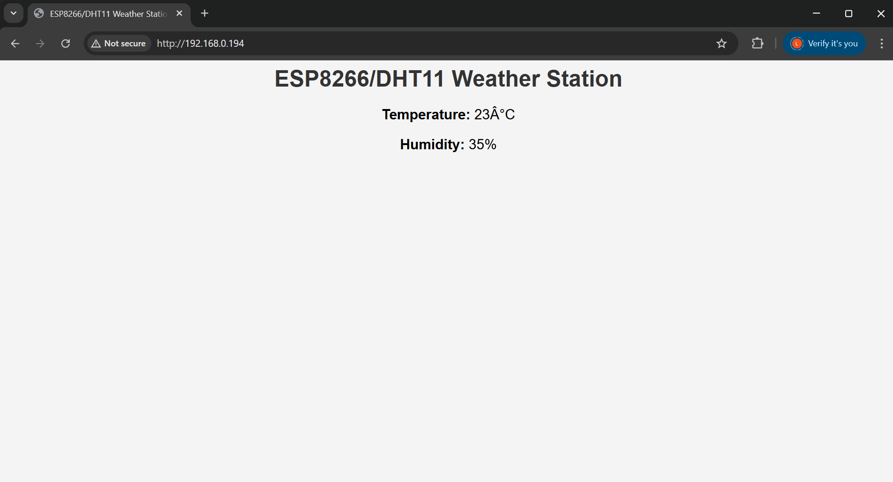
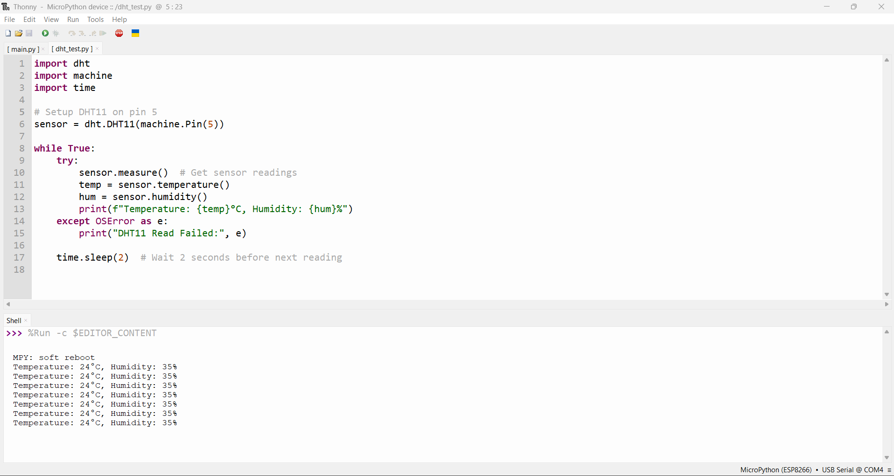
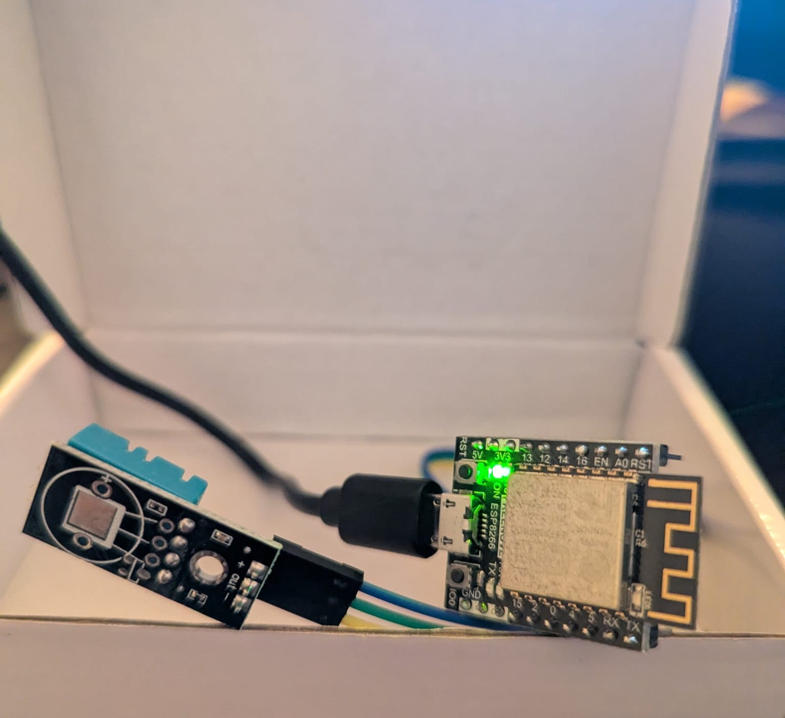

# 🌤️ ESP8266 IoT Weather Station

## 📌 Project Overview
This project uses an **ESP8266 microcontroller** with a **DHT11 temperature & humidity sensor** to create an **IoT weather station**. The ESP8266 runs a **MicroPython-based web server**, allowing real-time monitoring from any device on the network.

✅ **Reads real-time temperature & humidity**  
✅ **Hosts a web server to display data**  
✅ **Uses MicroPython & WiFi networking**  

## 🛠️ Hardware Used
- **ESP8266 (Freenove Development Board)**
- **DHT11 Temperature & Humidity Sensor**
- **Jumper Wires**

## 📜 Features
- **Web dashboard for real-time monitoring** 📊
- **Data refreshes every 5 seconds** 🔄
- **Built-in error handling for sensor failures** 🚀

## 📷 Screenshots
### **Live Web Dashboard**

### **Thonny Serial Output**

## ⚙️ ESP8266 IoT Weather Station – Live Setup

